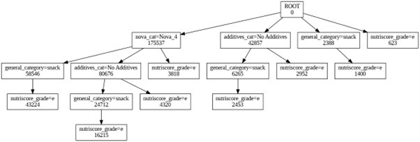

# Open Food Facts Dataset Analysis

## Giới thiệu

**Open Food Facts** là một bộ dữ liệu mở, được cộng đồng đóng góp, cung cấp thông tin chi tiết về các sản phẩm thực phẩm trên toàn thế giới.
Repository này tập trung vào việc **khai thác, phân tích và xây dựng mô hình Machine Learning** dựa trên dữ liệu Open Food Facts.

---

## 🎯 Mục tiêu dự án

* Tiền xử lý và làm sạch dữ liệu Open Food Facts
* Xây dựng mô hình **phân loại (Classification)** sản phẩm thực phẩm
* Thực hiện **phân cụm (Clustering)** để khám phá các nhóm sản phẩm tương đồng
* Sử dụng **Luật kết hợp** để tìm hiểu mối quan hệ giữa các thành phần dinh dưỡng và nhãn thực phẩm
* Phân tích thành phần dinh dưỡng và nhãn thực phẩm

---

## 📂 Cấu trúc thư mục

```text
OPENFOODFACTS/
├── classification model/   # Mô hình phân loại dạng pkl
├── clustering model/       # Mô hình phân cụm dạng pkl
├── code/                   # Script xử lý dữ liệu & huấn luyện & luật kết hợp 
├── csv/                    # Dữ liệu CSV đã làm sạch
└── requirements.txt        # Thư viện Python cần thiết
```

---

## 📊 Dữ liệu

Nguồn dữ liệu: **Open Food Facts**

* Website: [https://world.openfoodfacts.org](https://world.openfoodfacts.org)
* Dữ liệu bao gồm:

Người dụng tạo thư mục `csv/` sau đó vào link drive dưới đây tải dữ liệu có tên df_final (1).csv để thực hiện các bước tiếp theo. 

Drive: [Bộ dữ liệu Open Food Facts](https://drive.google.com/drive/folders/1tcjd1UQjF6lB7EnyTZVZtTA2m6_z1Os-?fbclid=IwY2xjawO2-5BleHRuA2FlbQIxMQBzcnRjBmFwcF9pZAEwAAEeFXEiVoyrP0mDSNN_CATAbXRU0ij-oy3ChVmEx5aTmO2E8gbRIINU9bChGNY_aem_T8-mVZTmEM8aC0i89Oj23w)

---

## 🧠 Bài toán thực hiện

### Phân lớp xếp hạng dinh dưỡng 

#### Lựa chọn biến đầu vào và xử lý nhãn mục tiêu
* Code thực hiện: code/classification.ipynb
* **Biến đầu vào (X):** Các đặc trưng dinh dưỡng trên 100g sản phẩm, được chuẩn hóa bằng **StandardScaler**, bao gồm:

  * `energy_100g`
  * `fat_100g`
  * `saturated-fat_100g`
  * `carbohydrates_100g`
  * `sugars_100g`
  * `fiber_100g`
  * `proteins_100g`

* **Nhãn mục tiêu (y):** `nutriscore_grade` với 5 mức đánh giá dinh dưỡng: **a, b, c, d, e**.
  Nhãn được mã hóa sang dạng số bằng **LabelEncoder** để phục vụ quá trình huấn luyện mô hình phân lớp đa nhãn.

#### Kết quả đánh giá mô hình phân lớp

Hiệu quả mô hình được đánh giá dựa trên các chỉ số **Precision**, **Recall** và **F1-score** cho từng nhãn Nutri-Score như sau:

| Nhãn | Precision | Recall | F1-score |
| ---- | --------- | ------ | -------- |
| a    | 0.81      | 0.88   | 0.84     |
| b    | 0.72      | 0.65   | 0.68     |
| c    | 0.79      | 0.79   | 0.79     |
| d    | 0.86      | 0.88   | 0.87     |
| e    | 0.93      | 0.92   | 0.93     |

Kết quả cho thấy mô hình hoạt động tốt hơn với các nhãn có mức dinh dưỡng rõ ràng (d, e), trong khi các nhãn trung gian như **b** và **c** có mức độ nhầm lẫn cao hơn do đặc trưng dinh dưỡng chồng lấn.

---


### 2️⃣ Clustering

#### Vấn đề đặt ra

Cách phân loại thực phẩm truyền thống (snack, drink, dairy,...) chủ yếu dựa trên mục đích sử dụng và cảm quan, chưa phản ánh đúng **giá trị dinh dưỡng cốt lõi**. Điều này dẫn đến bất đối xứng thông tin khi các sản phẩm cùng danh mục có thể có thành phần dinh dưỡng rất khác nhau. Vì vậy, nhóm áp dụng **thuật toán K-Means** nhằm tái phân loại thực phẩm dựa trên đặc trưng dinh dưỡng.

* Code thực hiện: code/clustering.ipynb
* **Biến đầu vào (X):**
 * `energy_100g`
  * `fat_100g`
  * `saturated-fat_100g`
  * `carbohydrates_100g`
  * `sugars_100g`
  * `fiber_100g`
  * `proteins_100g` 

#### Kết quả phân cụm

Dữ liệu được chia thành **4 cụm** với đặc trưng rõ ràng:

* **Cụm 0 – Năng lượng cao, nhiều đường:** bánh kẹo, đồ ăn ngọt; dễ dư thừa calo, ít protein.
* **Cụm 1 – Dinh dưỡng thấp:** nước khoáng, đồ uống không đường; không phải nguồn bổ sung dinh dưỡng chính.
* **Cụm 2 – Giàu protein:** ít đường và chất béo; phù hợp cho mục tiêu tăng cơ.
* **Cụm 3 – Giàu chất béo và đạm:** phô mai, hạt giàu dầu, thịt đỏ; carbohydrate thấp.

### 3️⃣ Luật kết hợp

* Code thực hiện: code\AssociationRule.ipynb

Bài toán luật kết hợp nhằm làm rõ hai vấn đề cốt lõi: (1) xác định mối quan hệ giữa mức độ chế biến cao (NOVA 4), hàm lượng phụ gia và chất lượng dinh dưỡng kém (NutriScore thấp); (2) phân tích sự phân bố phụ gia và dinh dưỡng theo từng **ngành hàng (general category)** để nhận diện các nhóm sản phẩm có nguy cơ cao.

Nhóm áp dụng thuật toán **FP-Growth** nhằm khai thác các luật có **Confidence** và **Lift** cao. So với Apriori, FP-Growth phù hợp hơn với bộ dữ liệu lớn như Open Food Facts nhờ cơ chế nén dữ liệu bằng FP-Tree, giúp giảm thời gian tính toán và cho phép thử nghiệm nhiều ngưỡng tham số khác nhau.

Các biến được sử dụng bao gồm: `nova_group`, `nutriscore_grade`, `additives_n` và `general_category`. Các chỉ số dinh dưỡng chi tiết được loại bỏ để tránh sinh ra các luật hiển nhiên và giúp mô hình tập trung vào mối quan hệ giữa **chất lượng dinh dưỡng tổng hợp**, **mức độ chế biến** và **ngành hàng**, từ đó tạo ra các luật có ý nghĩa và dễ diễn giải.

**Kết quả**
Cây FP-Growth tree với support_threshold = 0.3



---

## ⚙️ Cài đặt

```bash
pip install -r requirements.txt
```

Yêu cầu:

* Python >= 3.12

---

## ▶️ Cách sử dụng

1. Chuẩn bị dữ liệu trong thư mục `csv/`, tải dữ liệu như hướng dẫn
2. Chạy các script tiền xử lý và Huấn luyện mô hình trong `code/`
3. Lưu các model để tái sử dụng trong:
   * `classification model/`
   * `clustering model/`

---

Sản phẩm được thực hiện trong khuôn khổ môn học Khai phá dữ liệu – Đại học Kinh tế Thành phố Hồ Chí Minh (UEH).

**Giảng viên hướng dẫn:** TS. Nguyễn Thành Huy

**Thành viên nhóm:**

* Vương Thùy Linh ([@thilinnd](https://github.com/thilinnd))
* Hoàng Thụy Hồng Ân ([@anhoang0502](https://github.com/anhoang0502))
* Trần Khánh Ngân ([@khanhngantranvn](https://github.com/khanhngantranvn))
* Bùi Linh Đan [@danbui31231027178-stack][https://github.com/danbui31231027178-stack]
* Trần Quốc Đạt [@DatOneGuyL](https://github.com/DatOneGuyL)